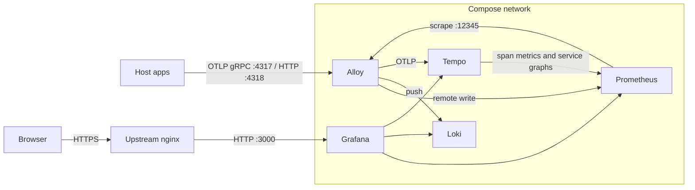

# Grafana OTel tests

Local Grafana stack for OpenTelemetry. Host applications send logs, metrics, and traces to Grafana Alloy over OTLP. Alloy writes logs to Loki, metrics to Prometheus, and traces to Tempo. Grafana is the only service published for browsers, and on the intended deployment TLS ends at an upstream nginx that proxies to port 3000.

Image tags are pinned in [`docker/compose.yaml`](docker/compose.yaml).

## Contents

- [Architecture](#architecture)
- [Repository layout](#repository-layout)
- [Prerequisites](#prerequisites)
- [Configure and start](#configure-and-start)
- [Open Grafana](#open-grafana)
- [Look at telemetry](#look-at-telemetry)
- [Stack process logs](#stack-process-logs)
- [Retention and volumes](#retention-and-volumes)
- [Python applications](#python-applications)
- [Troubleshooting](#troubleshooting)
- [References](#references)

## Architecture



Alloy's Loki exporter writes each record as JSON (`body`, `attributes`, `resources`, `instrumentation_scope`) and adds default stream labels: `job` (the OpenTelemetry `service.name`), `instance` (`service.instance.id`, when set), `level`, and `exporter="OTLP"`. The Alloy config also promotes `event_name` and `event_type` to labels, then copies `device_id`, `device_version`, `device_name`, and `device_groups` into structured metadata. Those fields come from [`python/particle-event-forwarder.py`](python/particle-event-forwarder.py).

Grafana datasources are provisioned in [`docker/config/grafana/provisioning/datasources/datasources.yml`](docker/config/grafana/provisioning/datasources/datasources.yml):

| Datasource | UID | Address inside Compose | Correlation |
| --- | --- | --- | --- |
| Prometheus | `prometheus` | `http://prometheus:9090` | Exemplars open in Tempo |
| Loki | `loki` | `http://loki:3100` | A `trace_id` field opens in Tempo |
| Tempo | `tempo` | `http://tempo:3200` | Traces link to Loki and Prometheus; service map and node graph are on |

Tempo enables HTTP streaming so Grafana can stream query results, and the local-blocks processor so TraceQL metrics queries work. Its metrics generator remote-writes span metrics and service graphs to Prometheus.

## Repository layout

```
run.sh                     # docker compose wrapper; defaults to `up -d`
docker/
  compose.yaml
  .env.example             # copy to docker/.env (gitignored)
  config/
    alloy/config.alloy
    grafana/provisioning/datasources/datasources.yml
    loki/loki.yml
    nginx/grafana.conf.example   # snippet for the upstream nginx; Compose does not run it
    prometheus/prometheus.yml
    tempo/tempo.yml
python/
  app.py                   # Flask dice server (auto-instrumented)
  main.py                  # manual OTLP logs loop
  minimal.py               # one OTLP/HTTP log line
  particle-event-forwarder.py
  test-particle-event-forwarder.py
  requirements.txt
```

## Prerequisites

`./run.sh` calls the Compose v2 plugin (`docker compose`, with a space). `docker compose version` must succeed before the first start.

### macOS

```bash
# softwareupdate --install-rosetta   # only if you must run x86 images
brew install docker colima
brew install docker-compose
```

Important: After `brew install docker-compose`, check the console's output and
follow Homebrew's caveats so the binary is registered as a Docker CLI plugin,
then confirm with `docker compose version`.

Colima's default virtual machine is 2 CPUs and 2 GiB. That is too small for
medium sized requests such as a "6-hour number of unique devices":
`count(sum by (device_id) (count_over_time({event_name="spark/device/diagnostics/update"}[10m])))`,
which stalls the Loki proces, causing Grafana to report connection refused.
So, bump Colima's VM defaults to 4 CPUs and 4 GiB in `~/.colima/default/colima.yaml`:

```yaml
cpu: 4
memory: 4
```

Reboot the computer, then run:

```bash
colima start
```

Confirm the CPU and memory settings with `docker info | grep -E '(CPUs|Mem)'`.
Finally test that docker is working with:

```bash
docker run --rm hello-world
```

### Linux VPS

Install Docker Engine and the Compose plugin from Docker's packages, then confirm `docker compose version`. The VPS also needs an existing nginx (or equivalent) that already proxies to this host on port 3000. Compose does not terminate TLS.

## Configure and start

From the repository root:

```bash
cp docker/.env.example docker/.env
```

Edit `docker/.env`:

| Variable | Purpose |
| --- | --- |
| `GRAFANA_DOMAIN` | Public hostname browsers use, such as `grafana.example.com`. Grafana's root URL is `https://$GRAFANA_DOMAIN/`. |
| `GRAFANA_ADMIN_USER` | Admin user name, applied when that user is first created. |
| `GRAFANA_ADMIN_PASSWORD` | Admin password, applied when that user is first created. |

`docker/.env` is gitignored. `./run.sh` exits if the file is missing.

Grafana creates that admin user on first start and stores it in the `grafana-data` volume. Editing the password in `.env` later leaves the existing user unchanged. Recreate the user by removing that volume (see [Retention and volumes](#retention-and-volumes)), which also removes dashboards and other Grafana state.

Start the stack:

```bash
./run.sh
```

That is `docker compose -f docker/compose.yaml --env-file docker/.env up -d`. Extra arguments are passed through:

```bash
./run.sh ps
./run.sh down
./run.sh restart loki
./run.sh up -d --force-recreate loki
```

`down` stops containers and leaves named volumes in place.

### Services

| Service | Image | Memory limit | On the host | Role |
| --- | --- | --- | --- | --- |
| `grafana` | `grafana/grafana:12.3.1` | 512m | `3000` on all interfaces | UI. Anonymous access and sign-up are off. |
| `prometheus` | `prom/prometheus:v3.9.1` | 768m | unpublished | 30-day TSDB. Remote write is on. Scrapes Alloy's own metrics. |
| `loki` | `grafana/loki:3.6` | 3g (`GOMEMLIMIT` 2700MiB) | unpublished | Single-binary logs. Filesystem storage. |
| `tempo` | `grafana/tempo:2.10.8` | 768m | unpublished | Traces, TraceQL metrics, span metrics. |
| `tempo-init` | `busybox:1.37` | — | — | One-shot `chown` so Tempo (uid 10001) can write its volume. Exits successfully. |
| `alloy` | `grafana/alloy:v1.12.2` | 512m | `127.0.0.1:4317` (gRPC) and `127.0.0.1:4318` (HTTP) | OTLP receiver and router. UI port 12345 stays on the Compose network. |

Grafana waits until Prometheus is healthy and Loki and Tempo have started. Loki and Tempo images are distroless, so they have no shell and no Compose healthcheck.

Each container's stdout is capped at three rotating JSON files of 10MB. Named volumes (metrics, logs, traces, Grafana state) are separate from that cap.

### Reload a config change

Config files are bind-mounted. Restart the service so the process reads the file again:

```bash
./run.sh restart loki
```

Service names are `grafana`, `prometheus`, `loki`, `tempo`, and `alloy`. When the change is in `docker/compose.yaml` itself (image, port, environment, volume), bring the service up again so Compose recreates it:

```bash
./run.sh up -d loki
```

Add `--force-recreate` when Compose reports the service is already up to date and you still need a new container.

## Open Grafana

Sign in at `https://$GRAFANA_DOMAIN` with the admin user from `docker/.env`.

Grafana is configured for that HTTPS origin: `GF_SERVER_ROOT_URL` is `https://$GRAFANA_DOMAIN/` and the session cookie is marked Secure. Use the HTTPS hostname. A tab on `http://localhost:3000` drops the cookie, so the login does not stick.

Port 3000 is published on all host interfaces. Keep it reachable from the nginx host and closed to the public internet; TLS and the public name belong on nginx.

On the nginx host, merge the proxy headers from [`docker/config/nginx/grafana.conf.example`](docker/config/nginx/grafana.conf.example) into the existing `server` block that already forwards to this machine on port 3000:

- `Host`, `X-Forwarded-Proto: https`, `X-Forwarded-Host`, `X-Real-IP`, `X-Forwarded-For`
- WebSocket `Upgrade` / `Connection` (the `map` at the top of the example)

Leave `proxy_pass` on port 3000. Replace `grafana.example.com` and `VPS_IP` in the example. Reload nginx after the merge.

## Look at telemetry

In Grafana, open **Explore** and pick a datasource. The same host as the login page is the one that works (`https://$GRAFANA_DOMAIN`).

### Logs (Loki)

Particle events and other OTLP logs are stored in Loki. Loki's port 3100 stays on the Compose network, so Grafana is the way to read them.

```logql
{job="particle-event-forwarder"}
```

```logql
{job="particle-event-forwarder", event_name="HttpRequestStatistics"}
```

`device_id`, `device_version`, `device_name`, and `device_groups` are structured metadata, so they filter after the stream selector:

```logql
{job="particle-event-forwarder"} | device_id="e00fce682e79a004f1e69a2b"
```

The logger name is nested in the JSON line (`tool.particle` for events, `tool.internal` for the forwarder itself):

```logql
{job="particle-event-forwarder"} | json | instrumentation_scope_name="tool.particle"
```

The dice server is `{job="dice-server"}`. The loop in `python/main.py` is `{job="demo-python-app"}`.

Path: application → Alloy `127.0.0.1:4317` or `:4318` → Loki → Grafana.

### Metrics (Prometheus)

Prometheus is the default datasource. Application metrics arrive by remote write through Alloy. Prometheus also scrapes Alloy at `alloy:12345`, and Tempo's metrics generator writes span metrics and service graphs here.

### Traces (Tempo)

Tempo accepts OTLP from Alloy only (its own receiver is on the Compose network). Use Explore with the Tempo datasource. A trace id found in a Loki line opens here via the derived field, and Prometheus exemplars with a `trace_id` label do the same.

## Stack process logs

Grafana, Loki, Alloy, and the other services write their own stdout here (startup, query errors, flushes). These lines are separate from Particle events and other application logs.

```bash
./run.sh logs -f loki
./run.sh logs -f alloy
./run.sh logs -f grafana
```

The Compose project name is `grafana-otel-tests`, so the same stream is `docker logs -f grafana-otel-tests-loki-1` (and the matching name for each service).

## Retention and volumes

| Store | Retention | Volume |
| --- | --- | --- |
| Grafana | until the volume is removed | `grafana-data` |
| Prometheus | 30 days | `prometheus-data` |
| Loki | 60 days (`1440h`), compactor deletes chunks | `loki-data` |
| Tempo | 72 hours | `tempo-data` |

Volume names on the host are prefixed with the project name, for example `grafana-otel-tests_loki-data`.

`./run.sh down` keeps the volumes. To delete them (metrics, logs, traces, and Grafana state):

```bash
./run.sh down -v
```

With the stack stopped, list volumes with `docker volume ls` and remove one by its full name:

```bash
docker volume rm grafana-otel-tests_grafana-data
```

## Python applications

The Python programs run on the host and send telemetry to Alloy on this machine: gRPC `http://127.0.0.1:4317` or HTTP `http://127.0.0.1:4318`.

### Install

```bash
python3 -m venv .venv
source .venv/bin/activate
python -m pip install -r python/requirements.txt
opentelemetry-bootstrap -a install
```

`source .venv/bin/activate` applies to the current shell. `opentelemetry-bootstrap` installs the instrumentation packages that match what is already installed (Flask, requests, logging). Run it after `requirements.txt`, with the virtualenv active.

### Flask dice server

[`python/app.py`](python/app.py) is the OpenTelemetry Python dice example: `GET /rolldice` rolls 1–6, records a `roll` span, increments the `dice.rolls` counter, and writes a log line. Optional query parameter: `player`.

Console exporters (the stack can be stopped):

```bash
source .venv/bin/activate
cd python
export OTEL_PYTHON_LOGGING_AUTO_INSTRUMENTATION_ENABLED=true
opentelemetry-instrument \
  --metrics_exporter console \
  --logs_exporter console \
  --traces_exporter console \
  --service_name dice-server \
  flask run -p 8080
```

OTLP exporters (start the stack first with `./run.sh`):

```bash
source .venv/bin/activate
cd python
export OTEL_PYTHON_LOGGING_AUTO_INSTRUMENTATION_ENABLED=true
opentelemetry-instrument \
  --metrics_exporter otlp \
  --logs_exporter otlp \
  --traces_exporter otlp \
  --service_name dice-server \
  flask run -p 8080
```

Then, from another shell: `curl 'http://127.0.0.1:8080/rolldice?player=ada'`.

Override the collector with `OTEL_EXPORTER_OTLP_ENDPOINT` and `OTEL_EXPORTER_OTLP_PROTOCOL` (`grpc` or `http/protobuf`) when the default endpoint is elsewhere.

### Manual OTLP scripts

[`python/main.py`](python/main.py) sends a log line every two seconds to `http://localhost:4317` (gRPC) as `service.name=demo-python-app`. It defines a `demo_requests_total` counter and never calls `add`, so that series stays absent.

[`python/minimal.py`](python/minimal.py) sends one log line, `Hello, logs are flowing!`, to `http://localhost:4318/v1/logs` and prints it on the console. Run either script with the virtualenv active and the stack up:

```bash
source .venv/bin/activate
python python/minimal.py
python python/main.py
```

### Particle event forwarder

[`python/particle-event-forwarder.py`](python/particle-event-forwarder.py) reads a Particle product's event stream and writes each event to Loki through Alloy.

```bash
source .venv/bin/activate
export PARTICLE_PRODUCT_ID="your-product-id"
export PARTICLE_AUTH_TOKEN="your-token"
export TOOL_INTERNAL_CONSOLE=1
python python/particle-event-forwarder.py
```

| Variable | Required | Meaning |
| --- | --- | --- |
| `PARTICLE_PRODUCT_ID` | yes | Particle product id. |
| `PARTICLE_AUTH_TOKEN` | yes | Particle API bearer token. Kept in the environment only. |
| `OTEL_EXPORTER_OTLP_ENDPOINT` | no | OTLP gRPC endpoint. Default `http://127.0.0.1:4317`. |
| `TOOL_INTERNAL_CONSOLE` | no | `1`, `true`, `yes`, or `on` also prints `tool.internal` lines on stderr. |

On startup the process loads the product device list (`GET /v1/products/{id}/devices`) and refreshes it every 24 hours. It then follows `GET /v1/products/{id}/events`. Disconnects retry with backoff from 1 second up to 60 seconds. HTTP 401 or 403 on the stream exits the process.

Each forwarded event is an info log on logger `tool.particle` with resource `service.name=particle-event-forwarder`. The OpenTelemetry body is the Particle `data` field. In Loki that record is a JSON line: the payload is `body`, and the logger name is `instrumentation_scope.name`. Attributes include `event_name`, `event_type` (`publish`, or the webhook hook type), `device_id`, `device_version`, `device_name`, `device_groups`, and `publish_time`. Webhook response events (`particle-internal` device id, event name shaped like `{device_id}/{hook_type}/{event_name}/{attempt}`) are rewritten so `device_id` and `event_name` refer to the device; the original name is kept as `original_event_name`. `hook-sent` events are dropped. Unknown device names and groups are stored as `NA!`.

The forwarder's own messages use logger `tool.internal`. With `TOOL_INTERNAL_CONSOLE` set, only that logger is copied to the terminal. Particle events stay in Loki.

Query: `{job="particle-event-forwarder"}`.

### Tests

```bash
source .venv/bin/activate
python python/test-particle-event-forwarder.py
```

`LiveOtlpTests` runs only when something accepts TCP connections on `127.0.0.1:4317`. Otherwise that test is skipped.

## Troubleshooting

**`./run.sh` says `docker/.env` is missing.** Copy `docker/.env.example` to `docker/.env` and set the three variables.

**`docker compose` is not a command.** The Compose v2 plugin is not on Docker's plugin path. Re-check the Homebrew caveats (macOS) or the Docker Engine Compose plugin (Linux). `./run.sh` does not call the hyphenated `docker-compose` binary.

**Grafana login returns you to the form.** The browser is on `http://localhost:3000` or on a host that does not match `GRAFANA_DOMAIN`. Open `https://$GRAFANA_DOMAIN` and confirm nginx sends `X-Forwarded-Proto: https`.

**Admin password in `.env` seems ignored.** The account was created earlier and is stored in `grafana-data`. Remove that volume to recreate the admin user from the current `.env`.

**A config edit has no effect.** Restart that service (`./run.sh restart loki`). If the edit was in `docker/compose.yaml`, run `./run.sh up -d <service>`.

**`tempo-init` is stopped.** That is the expected end state. It only fixes ownership of the Tempo volume and then exits.

**Loki or Tempo has no healthcheck.** Those images are distroless. Use `./run.sh logs -f loki` (or `tempo`) and Grafana's datasource health.

**Loki queries fail with connection refused.** On macOS this is usually the Colima VM still on its default 2 CPUs and 2 GiB. Grafana's request dies while Loki is restarted out from under it. See pre-requisites to increase Memory assigned.

**No Particle lines in Loki.** The forwarder must be running on this host, `PARTICLE_*` must be set, and Alloy must be up (`./run.sh ps`). Confirm with `{job="particle-event-forwarder"}` over a range that covers the run. `tool.internal` lines in the terminal (`TOOL_INTERNAL_CONSOLE=1`) show whether the stream connected.

## References

- [Tempo Docker Compose examples](https://github.com/grafana/tempo/tree/main/example/docker-compose)
- [Tempo local-blocks processor](https://grafana.com/docs/tempo/latest/metrics-from-traces/metrics-queries/configure-traceql-metrics/#activate-and-configure-the-local-blocks-processor) (TraceQL metrics)
- [Tempo `stream_over_http_enabled`](https://grafana.com/docs/tempo/latest/configuration/#stream-over-http) (streaming queries from Grafana)
- [Provision Grafana data sources](https://grafana.com/docs/grafana/latest/administration/provisioning/#data-sources)
- [Provision Prometheus](https://grafana.com/docs/grafana/latest/datasources/prometheus/configure/#provision-the-prometheus-data-source)
- [Provision Loki](https://grafana.com/docs/grafana/latest/datasources/loki/#provisioning-examples)
- [Provision Tempo](https://grafana.com/docs/grafana/latest/datasources/tempo/configure-tempo-data-source/#example-file)
- [OpenTelemetry Python getting started](https://opentelemetry.io/docs/languages/python/getting-started/)
